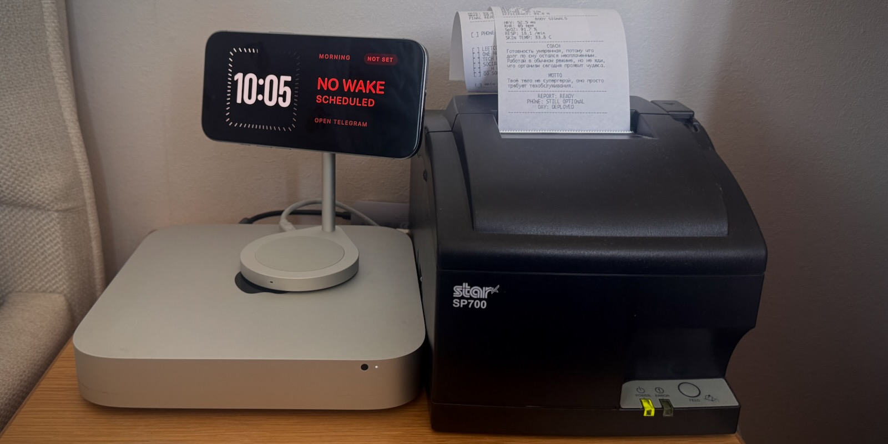
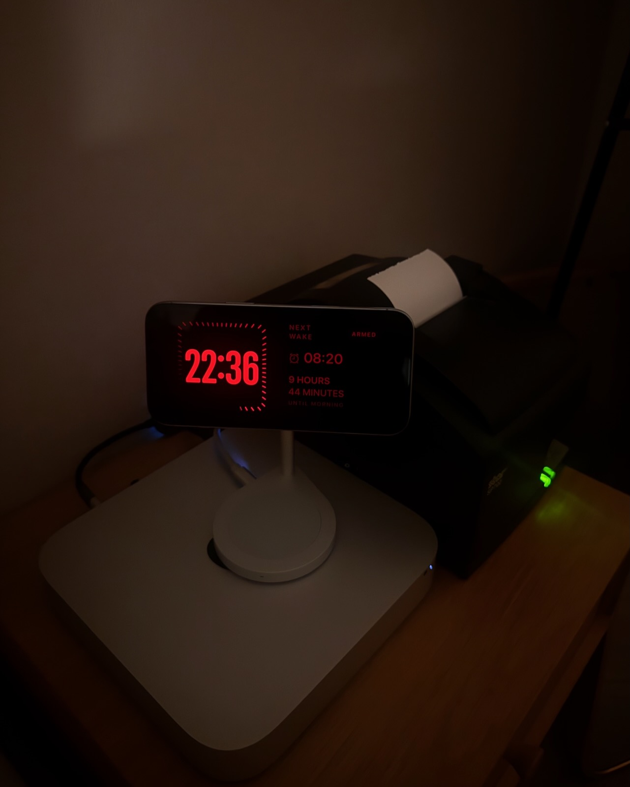
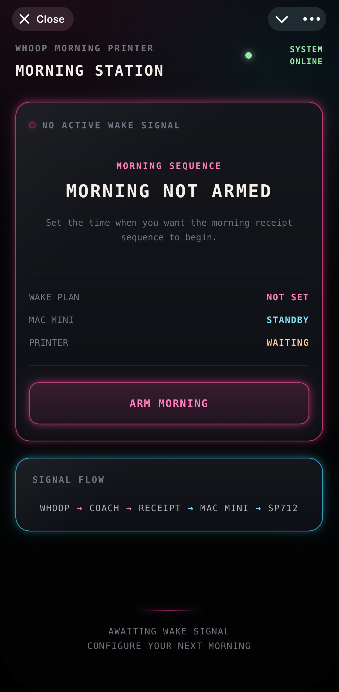
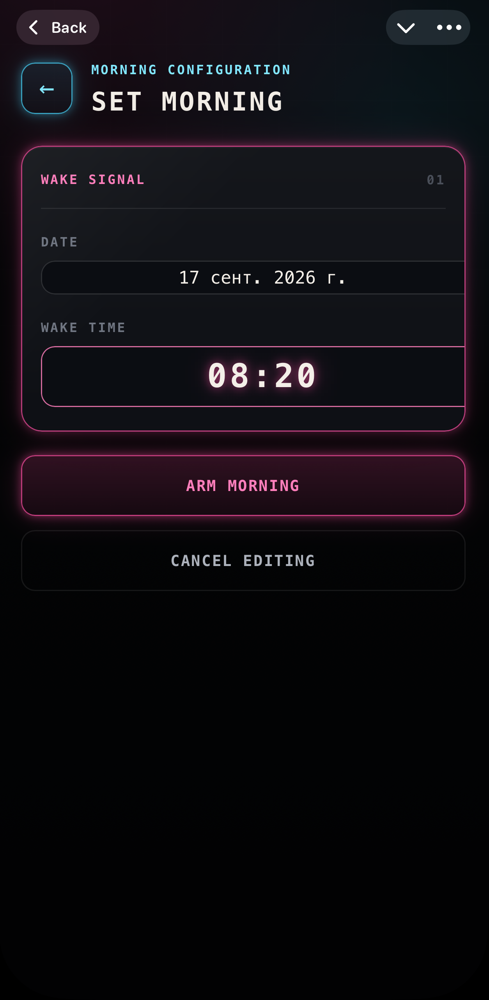
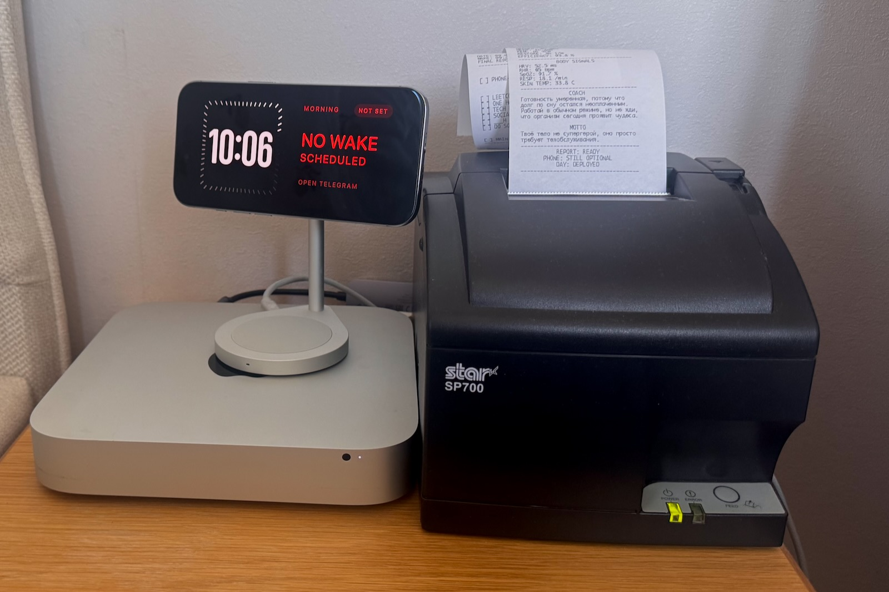
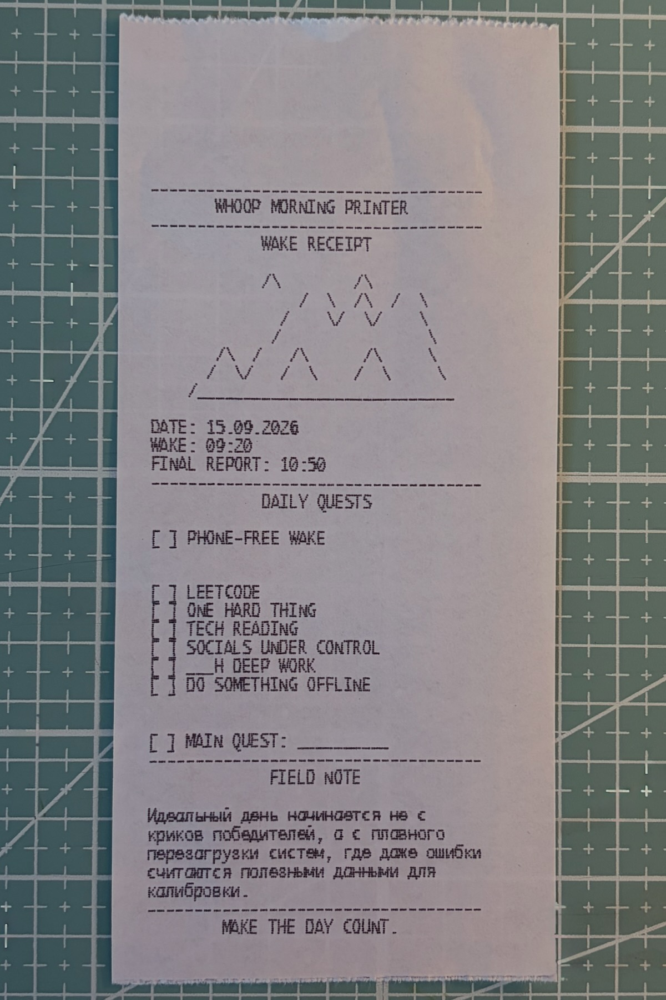
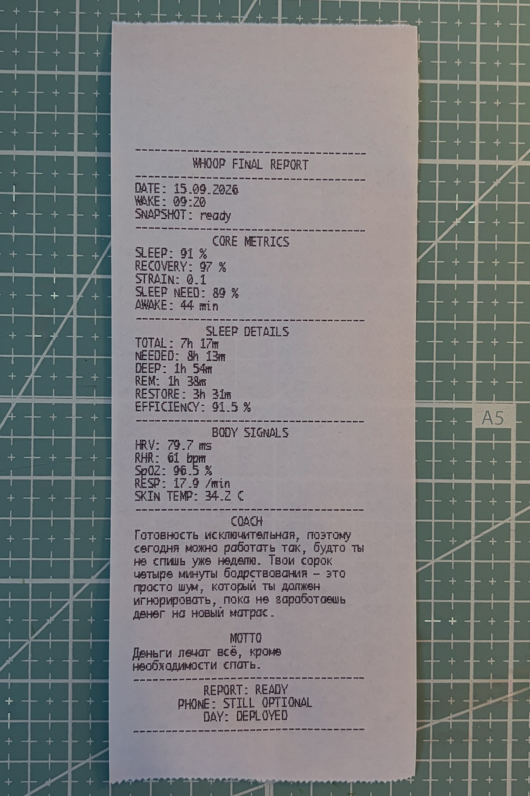
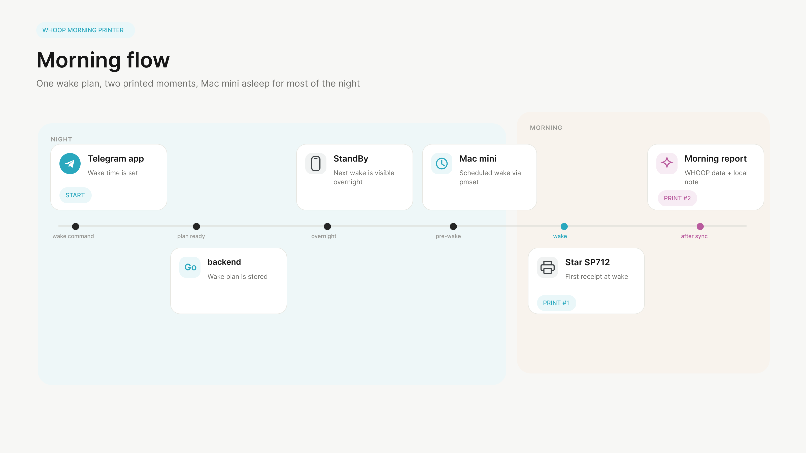
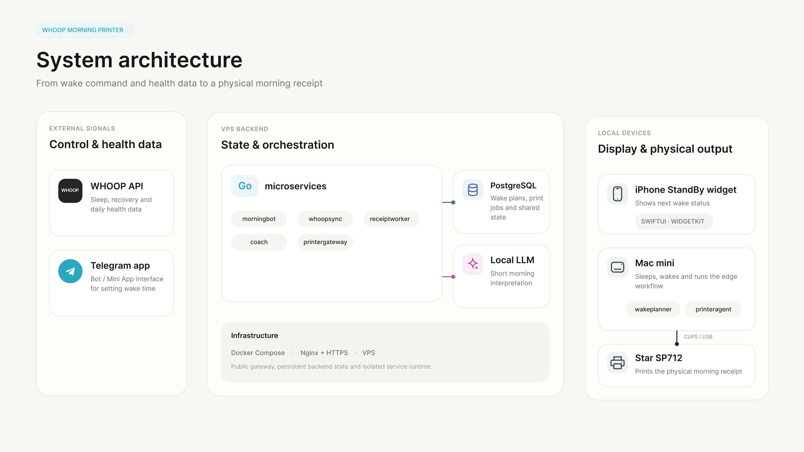
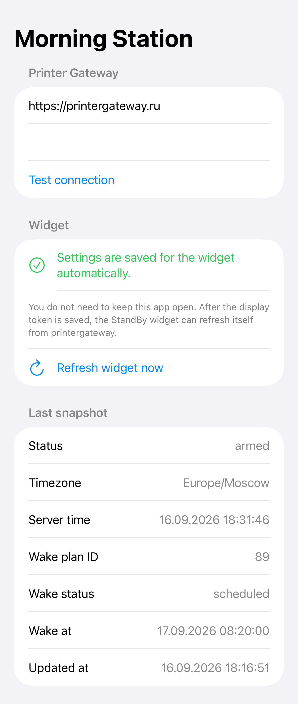

# WHOOP Morning Printer
 
A personal morning automation system that turns a Telegram wake command into a physical receipt printed by a Mac mini that wakes itself shortly before the alarm, with WHOOP data and an iPhone StandBy widget in the loop.

  
## Overview

WHOOP Morning Printer is a personal engineering project built around a deliberately odd morning ritual: I wanted to get my WHOOP data without opening my phone, and I wanted the wake-up signal to be the mechanical sound of a dot-matrix receipt printer coming to life.

The system lets me set a wake time in Telegram, stores the active wake plan on a Go backend, wakes a Mac mini before the alarm, prints a physical morning receipt on a Star receipt printer, and shows the next wake status on an iPhone StandBy widget.

The project connects health data, a Telegram bot, backend services, a small local LLM for lightweight interpretation, macOS automation, receipt printing, and an iPhone StandBy widget into a single morning workflow.

  

## Why

My mornings had a very predictable failure mode: the alarm goes off, I pick up the phone, and a minute later I am already looking at notifications, messages, or something completely unrelated to getting out of bed.

At the same time, I wanted to see my WHOOP data in the morning. Sleep, recovery, HRV and the rest of it are actually useful context for the day. I just did not want another app to be the first interface I interacted with.

A receipt printer turned out to be a much more entertaining interface. It is physical, intentionally limited, impossible to scroll, and loud enough to act as part of the wake-up signal. Instead of opening an app, I get a piece of paper with a short boot sequence first, and later a second receipt with recovery data and a small locally generated interpretation of it.

  

## Table of contents

- [Overview](#overview)
- [Why](#why)
- [What it looks like](#what-it-looks-like)
- [How it works](#how-it-works)
- [Architecture](#architecture)
- [Components](#components)
- [Mac mini and printing](#mac-mini-and-printing)
- [iPhone app and StandBy widget](#iphone-app-and-standby-widget)
- [Security](#security)
- [Infrastructure and operations](#infrastructure-and-operations)
- [Tech stack](#tech-stack)
- [Project status](#project-status)
- [Roadmap](#roadmap)
- [Progress](#progress)
- [License](#license)

  
## What it looks like

The project lives across a few very different surfaces: Telegram for control, an iPhone in StandBy mode, a Mac mini running the automation, and a physical Star receipt printer that produces the morning output.

  

### StandBy widget
 

  

The widget shows the next scheduled wake time and stays useful even when the MorningStation app itself is closed.

 

### Telegram Mini App

The wake plan is configured through a Telegram Mini App, which acts as the main control surface for creating, editing and cancelling the morning schedule.

  
  &nbsp;&nbsp;&nbsp;&nbsp;
  

  

### Physical setup

  

  
A Mac mini runs the edge-side automation, controls sleep and wake scheduling, and prints through CUPS to the Star SP700.

### Physical output

  
  &nbsp;&nbsp;&nbsp;&nbsp;
  

Wake receipt &nbsp;&middot;&nbsp; Final WHOOP report

The first receipt acts as a physical wake-up signal and a short morning boot sequence. A second receipt contains the morning health metrics and a short interpretation generated locally.

  
## How it works

The routine starts in Telegram and ends with paper coming out of the printer.

  
1. I set the wake time in Telegram or the MorningStation iPhone widget.

2. The backend stores the active wake plan and makes it available to the rest of the system.

3. The iPhone StandBy widget picks up the same wake plan and shows the next scheduled wake time.

4. A Mac mini stays asleep for most of the night and wakes up shortly before the alarm.

5. The printing side of the system prepares and claims the wake receipt job.

6. The Star SP700 starts printing, and its mechanical noise becomes part of the wake-up signal.

7. Later, once the morning health data is ready, a second receipt is printed with WHOOP metrics and a short locally generated interpretation.

  
The important part is that none of this requires opening the MorningStation app or manually starting anything on the Mac mini. Once the wake time is set, the routine runs on its own.

  

## Architecture

The system is split across three environments: external services, a VPS backend, and local devices in my home network.

  
The VPS is the persistent part of the system. It stores wake plans and print jobs, synchronizes WHOOP data, generates the morning interpretation, and exposes a small HTTPS gateway used by the devices outside the server.

The Mac mini acts as the physical edge node. It spends most of its time asleep, wakes when needed, talks to the backend over HTTPS, and sends print jobs to the Star SP700 through CUPS.

The iPhone is intentionally a separate client. The StandBy widget reads the active wake state from the backend and keeps it visible overnight without depending on the main app being open.

  
## Components

Project is intentionally split into small services and edge-side agents. Each component has a narrow responsibility, which makes the physical workflow easier to reason about and recover when something goes wrong.

| Component | Runs on | Responsibility |
| --- | --- | --- |
| `morningbot` | VPS | Telegram interface for setting and managing the active wake plan |
| `whoopsync` | VPS | Synchronizes sleep, recovery and other morning data from WHOOP |
| `coach` | VPS | Turns health metrics into a short morning interpretation using a local LLM |
| `receiptworker` | VPS | Builds the wake and morning reports and creates print jobs |
| `printergateway` | VPS | Authenticated HTTPS boundary used by the Mac mini and the StandBy widget |
| `wakeplanner` | Mac mini | Reads the active wake plan and schedules macOS wake and sleep using `pmset` |
| `printeragent` | Mac mini | Claims print jobs, sends them to CUPS and reports the result back to the backend |
| `MorningStation` | iPhone | Stores gateway and widget configuration, provides connection diagnostics, and exposes the latest widget snapshot |
| `MorningStationWidget` | iPhone | Fetches the active wake state from `printergateway` independently and displays it in StandBy mode |

  

## Mac mini and printing

The Mac mini is the physical edge of the system. It does not need to stay awake all night: after receiving the active wake plan, it schedules its next wake-up with macOS `pmset` and goes back to sleep.

Two small agents run on the Mac:

- `wakeplanner` reads the active wake plan from the backend, calculates when the Mac should wake, configures the system wake event with `pmset`, and returns the machine to sleep.

- `printeragent` polls the HTTPS gateway for print jobs, claims them, sends the receipt to CUPS, and reports whether the job was printed successfully.

Both agents are managed by macOS `launchd`, so they start automatically and recover without requiring an interactive user session.

The Star SP700 is connected locally and exposed through CUPS. The backend never talks to the printer directly: it only creates print jobs. The Mac mini is responsible for turning those jobs into physical output.

This separation is useful for another reason: the Mac mini does not need direct access to PostgreSQL. The edge-side agents communicate only with `printergateway` over HTTPS, which keeps the database and backend internals on the VPS side.

  

### Wake sequence

A typical night looks roughly like this:

1. `wakeplanner` reads the current wake plan.

2. It schedules a macOS wake event shortly before the alarm.

3. The Mac mini goes back to sleep.

4. macOS wakes the machine automatically.

5. `printeragent` claims the pending wake receipt.

6. CUPS sends the job to the Star SP700.

7. The printer starts running - and its mechanical noise becomes part of the alarm itself.

  
## iPhone app and StandBy widget

The iPhone side is built around a small SwiftUI app and a WidgetKit extension designed for StandBy mode.

### MorningStation app

  

The main `MorningStation` app is mostly responsible for configuration: it stores the gateway URL and display token, provides connection diagnostics, and shares the required settings with the widget through an App Group.

### StandBy widget

The widget itself does not depend on the app staying open. It fetches the active wake state directly from `printergateway`, stores the latest successful response in a shared snapshot, and uses that cached value as a fallback if the next network request fails.

WidgetKit controls when the system actually refreshes the timeline, so the widget cannot behave like a real-time client. Instead, it requests regular updates and always keeps the latest known wake state available locally.

This was important for the intended use case: after setting the wake time in Telegram, I can close the app completely and still see the next wake time appear on the StandBy screen later.

## Security

The system is intentionally designed so that local devices do not connect directly to PostgreSQL.

All communication between the Mac mini, the iPhone widget, and the VPS goes through `printergateway` over HTTPS. The gateway exposes only the small set of operations required by each client.

Authentication is based on Bearer tokens. The printer-side agents and the read-only StandBy widget use separate tokens, so access for one client does not automatically grant the capabilities of another.

The public endpoint is terminated by Nginx, while the backend services and PostgreSQL remain on the server-side network.

No WHOOP credentials, database credentials, or backend-internal connection strings are required on the Mac mini or the iPhone.

  
## Infrastructure and operations

The backend runs on a self-managed VPS that acts as the always-on core of the system. The Mac mini and the iPhone are treated as external clients: persistent state, integrations, background processing and the local LLM all stay on the server side.

Current VPS configuration is:

- **CPU:** 8 vCPU, Intel Xeon Skylake-class, KVM virtualization

- **Memory:** 16 GB RAM

- **Storage:** 160 GB NVMe

Application services run as Docker containers and are managed with Docker Compose. Nginx provides the public HTTPS entry point, while PostgreSQL and internal service communication remain on the server-side network.

  

### CI/CD

The repository uses GitHub Actions for the build and deployment pipeline.

Changes pushed to the repository go through CI checks, container images are built automatically, and the deployment workflow updates the corresponding services on the VPS. This keeps deployment reproducible and avoids manually rebuilding containers on the server.

  

### Observability

The VPS also runs a separate observability stack for logs, container metrics and host-level monitoring.

- **Grafana** dashboards, exploration and queries

- **Prometheus** time-series metrics

- **Loki** centralized logs

- **Grafana Alloy** log collection and forwarding

- **cAdvisor** container CPU, memory, network and restart metrics

- **node_exporter** VPS host metrics such as CPU, memory, disk and network usage

The monitoring stack is isolated from the public application surface and is used for operational diagnostics and troubleshooting.

  

## Tech stack

- **Backend:** Go, Gin, PostgreSQL

- **Runtime:** Docker, Docker Compose

- **Reverse proxy & transport:** Nginx, HTTPS

- **CI/CD:** GitHub Actions

- **Infrastructure:** self-managed KVM VPS
  
- **Observability:** Grafana, Prometheus, Loki, Grafana Alloy, cAdvisor, node_exporter

- **macOS automation:** `launchd`, `pmset`

- **Printing:** CUPS, Star SP700

- **iOS:** Swift, SwiftUI, WidgetKit, App Groups

- **Telegram:** Telegram Bot API, Telegram Mini App / Web App, TypeScript

- **Health data:** WHOOP API

- **Local AI:** Ollama, currently running `qwen3.5:9b`

  
The Telegram Web App is written in TypeScript. Since frontend development is not my main area, I used ChatGPT as a coding assistant while building this part of the project and reviewed and integrated the resulting code myself.

  

## Project status

The core morning workflow is implemented and running end to end.

The system is currently able to:

- accept and update wake plans through the Telegram app;

- keep the active wake time visible on the iPhone StandBy widget;

- wake the Mac mini automatically before the alarm;

- create, claim and print wake receipts through the Star SP700;

- synchronize morning WHOOP data;

- generate a short local interpretation with Ollama and `qwen3.5:9b`;

- print the final morning report;

- recover from temporary widget or network failures using cached state;

- build and deploy backend containers through GitHub Actions;

- expose application logs and host/container metrics through the VPS observability stack.

The complete routine has been tested with the MorningStation app closed and the Mac mini asleep. Once a wake time is set, the rest of the workflow can complete without manually opening the app, logging into the server, or starting anything on the Mac.

At this point, the project is in regular personal use. Development is mostly focused on refinement, observability and packaging rather than completing the original core workflow.

## Roadmap

The core morning workflow is already working, so the next steps are mostly about making the physical side of the system smaller, more reliable and increasingly integrated with the room itself.

- **Move the edge node from Mac mini to a compact SBC** - replace the old Mac mini, which was originally used simply because it was available, with something closer to a Raspberry Pi. The goal is a smaller, quieter and more purpose-built device that can stay permanently attached to the printer.

- **Operational alerts** - extend the existing observability stack with useful alerts for failed print jobs, unhealthy services, missed morning runs and infrastructure problems.

- **Zigbee room automation** - add a Zigbee coordinator and connect physical devices to the wake workflow. One of the first experiments I want to try is a motorized window opener that can automatically open the window around wake time.

- **Android TV wake integration** - use the Android TV in the same room as another physical wake surface. The idea is to have the system automatically turn the TV on as part of the morning sequence, potentially showing a simple wake screen or morning status.

- **Multi-device wake scenarios** - once the printer, window actuator and TV can all participate in the same workflow, experiment with configurable wake sequences instead of treating the printer as the only output device.

## Progress

The project started as a simple idea to print WHOOP data in the morning and gradually grew into a complete physical wake-up system.

  

- [x] ~~Telegram wake-time control~~

- [x] ~~Persistent wake plans in PostgreSQL~~

- [x] ~~WHOOP data synchronization~~

- [x] ~~Go backend split into dedicated services~~

- [x] ~~Wake and final report generation~~

- [x] ~~Local health-data interpretation with Ollama and `qwen3.5:9b`~~

- [x] ~~Authenticated HTTPS gateway for external devices~~

- [x] ~~Mac mini automatic sleep and wake scheduling with `pmset`~~

- [x] ~~Automatic agent startup and recovery with `launchd`~~

- [x] ~~Print-job claiming and delivery through CUPS~~

- [x] ~~Physical printing on the Star SP700~~

- [x] ~~iPhone StandBy widget~~

- [x] ~~Widget refresh independent from the main iOS app~~

- [x] ~~Cached widget state for temporary network failures~~

- [x] ~~Separate access tokens for printer agents and the read-only display client~~

- [x] ~~Dockerized VPS deployment~~

- [x] ~~Automated container build and deployment with GitHub Actions~~

- [x] ~~VPS observability with Grafana, Prometheus, Loki, Alloy, cAdvisor and node_exporter~~

  

- [ ] Migrate the physical edge from Mac mini to a compact SBC

- [ ] Add operational alerts for failed or missed morning runs

- [ ] Add a Zigbee coordinator to the system

- [ ] Integrate a motorized window opener into the wake sequence

- [ ] Integrate the Android TV as another wake-up surface

- [ ] Build configurable multi-device wake scenarios

## License

Beerware. If we meet some day and you think this project was worth it,
you can buy me a beer.

See [LICENSE](LICENSE) for details.
